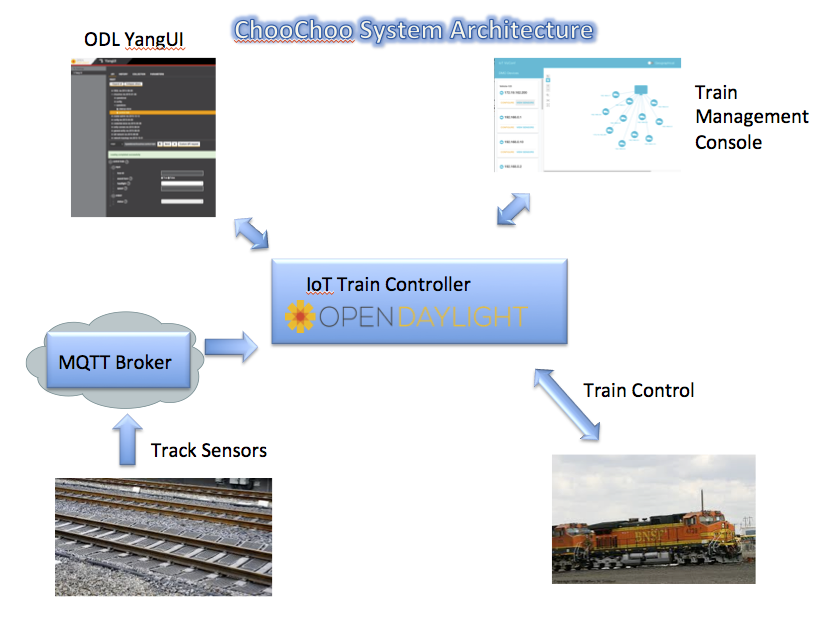

# OpenDaylight IOT Train Controller - ChooChoo

ChooChoo is an application designed for OpenDaylight (ODL). It controls the operation of a train as it rolls over sensors on
a 76 ft long track. A demo of this setup along with a learning lab will be available at Cisco Live! in Berlin.

The track has 12 sensors evenly spaced along the track. As the train nears the even numbered sensors, the ODL application
will respond to this by sounding the horn.  When the train nears the odd numbered sensors, the
train will turn off the horn, turn on the head light.  The solution is a bit contrived but it 
demonstrates how Opendaylight can detect when IOT sensor's send updates, perform some "control" logic to effect the state
of the train, send HTTP messages to the arduino running the train controller.

This application was developed as a educational tool to show how ODL can be used to manage IOT networks.  Typically, the
introductory exposure to ODL is a "Hello World" tutorial.  The purpose of the learning lab is to show, 1) 
ODL is NOT just for SDN development, ie it has applicability to IOT control and data collection, and 2) introduce the student
to a more complex tutorial.

## Team:

- John Burns
- Lionel Florit
- Varun Seereeram
- Kareem Iskander
- Mike Mackay

### Project demo Link:

[Find the code here](https://github.com/CiscoDevNet/choochoo)

### Social Tags:

IOT, Open Source, Train, Sensors, MQTT, RESTCONF API, YANG

### Project Kick-off Date:

December 2015

### Current Status:

Beta - send questions to johnburn@cisco.com

## Application Overview:

The IOT solution consists of the following components:
 - ChooChoo application running on ODL - a YANG model of the train(s), a module listening to MQTT topics which indicate what
is happening with the IOT sensors along the track, a module that reacts to changes in the sensors by sending HTTP commands
to the train, an API so the the ChooChoo GUI can send commands to the train.
 - ChooChoo GUI - a basic graphical user interface is provided to show the discovered trains on the track.  It allows certain aspects of the train to be controlled, such as sounding the horn, or turning on the headlamp.
 - YANG-UI - a GUI that allows users to view the YANG model for the ChooChoo app.
 - Train, track, and track sensors - arduinos are employed to monitor track sensors and to effect control of the train.

Figure 1 depicts the architecture of the components used in this application.

 Figure 1 ODL IOT Train Controller and Track Sensor Architecture

## Features:

- Developed to run on top of ODL
- Leverages RESTCONF APIs based on YANG models to model train topology
- Leverages RESTCONF APIs based on YANG models to enable train control via RPCs
- Leverages oneM2M APIs based on modelling of sensors in the oneM2M IOT data store
- Leverages the open source NeXt UI framework for topology visualization
- Source code in HTML5/CSS/Javascript, NeXt and node js

### References

- [https://wiki.opendaylight.org/view/IoTDM:Main](https://wiki.opendaylight.org/view/IoTDM:Main)

- [https://developer.cisco.com/site/neXt/](https://developer.cisco.com/site/neXt/)

