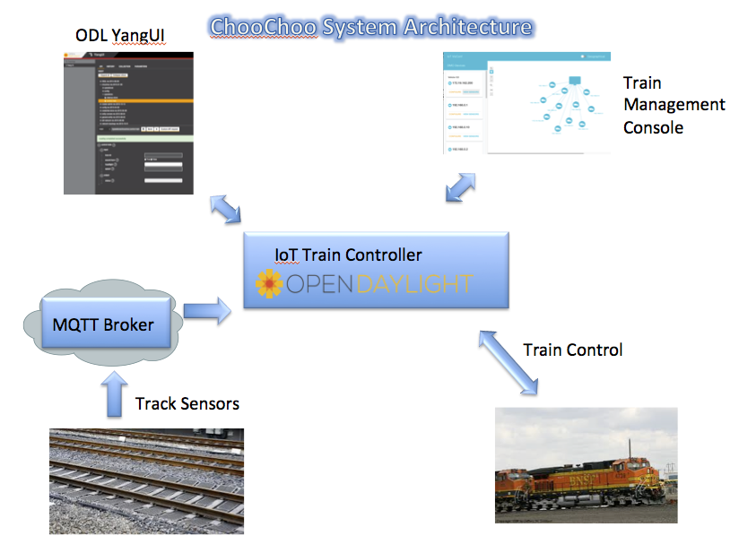

# Learning Lab: OpenDaylight IOT Train Controller - ChooChoo

## Introduction

This learning lab provides an opportunity to view all the moving parts of a sample IOT train controller application
written on the OpenDaylight (ODL) Development Platform.  In this lab, you can choose to look at actual code, or
you can simply read through to understand how ODL was used to control the train and monitor track sensors.
But first a little background ...

### OpendayLight Development Platform

The ODL platform is a rich software platform enabling the development of applications for the emerging set of
SDN protocols.  It is relatively straight-forward to develop a software appliance capable of controlling networks of
 networks of devices each of which requiring its own custom set of protocols. ODL's plugin architecture, coupled with
 its model driven approach, allows components to be developed independently of each other.  These components can be
 assembled into a feature rich application. See [https://opendaylight.org](https://opendaylight.org) for background
 on the software initiative.  Cisco currently ships a battle tested enhanced version of its ODL SDN Controller (OSC).
 
### IOT vs SDN

IOT *things* are network devices too!  Not only can ODL support SDN devices.  It can control any number of IOT devices.
Each of the IOT devices communicate with controllers or data collectors with any number of proprietary and
standards based protocols.  Some of the standards are OneM2M, OIC using wire protocols such as MQTT, CoAP, HTTP.  There
is an ODL project called IoTDM (Internet of Thigs Data Manager).  The project's goal is to support all of the standard
IOT protocols and specifications, and allow IOT things to be managed and controlled.  It provides an IOT
data repository/collector for all the data coming from the Things in the network.

There are cases where proprietary protocols come into play. Some devices have custom protocols.  ODL's plugin architecture
allows custom protocol plugins to be written such that the data can be adapted from southbound protocols, normalized and
put in a standards based datastore.  In this way, management apps written to support standard IOT devices can now easily
support devices that use custom, proprietary or legacy protocols.

### ChooChoo Train Controller IOT Solution

ChooChoo is an application designed for OpenDaylight (ODL). It controls the operation of a train as it rolls over sensors on
a 76 ft long track. A demo of this setup along is available in the devNetZone at Cisco Live! 2016 Berlin.

The track has 12 sensors evenly spaced along the track. As the train nears the even numbered sensors, the ODL application
will respond to this by sounding the horn.  When the train nears the odd numbered sensors, the
train will turn off the horn, turn on the head light.  The solution is a bit contrived but it 
demonstrates how ODL can monitor IOT sensor's, perform some "control" logic to effect the state
of the train, send HTTP messages to the arduino running the train micro-controller.

This application was developed as a educational tool to show how ODL can be used to manage IOT networks.  Typically, the
introductory exposure to ODL is a "Hello World" tutorial.  The purpose of the learning lab is to show, 1) 
ODL is NOT just for SDN development, ie it has applicability to IOT control and data collection, and 2) introduce the student
to a more complex tutorial.

## ChooChoo Train Architecture

The IOT solution consists of the following components:

- ChooChoo application running on ODL
    - a YANG model of the train(s)
    - a module listening to MQTT topics which indicate what
is happening with the IOT sensors along the track
    - a module that reacts to changes in the sensors by sending HTTP commands
to the train
    - an API so that the ChooChoo GUI can send commands to the train.
- ChooChoo GUI - a basic graphical user interface is provided to show the discovered trains on the track.  It allows certain aspects of the train to be controlled, such as sounding the horn, or turning on the headlamp.  The GUI can be reached at http://10.10.50.42:8000
- YANG-UI - a GUI that allows users to view the YANG model for the ChooChoo app.
- Train, track, and track sensors - arduinos are employed to monitor track sensors and to effect control of the train.

Figure 1 depicts the architecture of the components used in this application.

 Figure 1 ODL IOT Train Controller and Track Sensor Architecture
 
## Project:

In order to develop ODL apps, you really should familiarize yourself with some of the
[core tutorials](https://wiki.opendaylight.org/view/Controller_Core_Functionality_Tutorials:Main)
provided by ODL.  In particular, I found
[this](https://wiki.opendaylight.org/view/Controller_Core_Functionality_Tutorials:Application_Development_Tutorial) one
quite helpful.  Development may seem a bit daunting at first but just go for it and it'll get easier.  Don't hesitate to contact me;
my contact info is provided in the link where the actual code is stored.

[Find the code here](https://github.com/CiscoDevNet/choochoo)

### Implementation of the ODL IOT Controller
The [ODL app](https://github.com/CiscoDevNet/choochoo/tree/master/choochoo-odl) root folder contains a standard set of
folders: api, karaf, impl, features, ...  These were automatically generated by the [maven archetype]
 (https://wiki.opendaylight.org/view/Controller_Core_Functionality_Tutorials:Application_Development_Tutorial#Exercise_1:_Create_a_new_project_from_the_startup_archetype)
 that is essential to use when starting a project.
 
#### api: Data Model
The [data model](https://github.com/CiscoDevNet/choochoo/blob/master/choochoo-odl/api/src/main/yang/choochoo.yang) for the choo choo train is
written in yang.  The syntax is compiled at build time and java code is generated to help get access to the data structures in the model.
The trains are modelled in a container called train-topology.  There is a list of trains as we may want to support more than one train.
There is also an RPC to control the train.  This enables a [management application](https://github.com/CiscoDevNet/choochoo/tree/master/choochoo-gui)
or GUI to control the train.  Peruse the javascript and you might see it call an API to honk the horn.

#### impl: implementation that provides the train service
- [choochooProvider.java] (https://github.com/CiscoDevNet/choochoo/blob/master/choochoo-odl/impl/src/main/java/com/cisco/devnetlabs/choochoo/impl/ChoochooProvider.java)
    - This is the main entry file for the application. 
- [choochooMqttPlugin.java] (https://github.com/CiscoDevNet/choochoo/blob/master/choochoo-odl/impl/src/main/java/com/cisco/devnetlabs/choochoo/impl/ChoochooMqttPlugin.java)
    - This plugin implements the MQTT protocol to listen to a topic that will contain sensor info for the track.  When 
    the train rolls over one of 12 sensors, it posts a MQTT message to the MQTT broker containing sensor info. The application
     will send this information to the ChooChooSensorManager so that it can decide what "control" logic such as honk the horn.
- [choochooTrainManager.java] (https://github.com/CiscoDevNet/choochoo/blob/master/choochoo-odl/impl/src/main/java/com/cisco/devnetlabs/choochoo/impl/ChoochooTrainManager.java)
    - the train manager is responsible for interacting with the train micro-controller  to discover what trains are on the
    track.  It also can send HTTP messages to the train to control the headlight, and horn.
- [choochooSensorManager.java] (https://github.com/CiscoDevNet/choochoo/blob/master/choochoo-odl/impl/src/main/java/com/cisco/devnetlabs/choochoo/impl/ChoochooSensorManager.java)
    - when message arrive on subscribed MQTT topics, the sensor manger is notified.
    
#### karaf: a runtime distribution containing the choo choo train app
The karaf folder contains all of the files needed to run the application.
#### features:
The features folder contains an [xml] (https://github.com/CiscoDevNet/choochoo/blob/master/choochoo-odl/features/src/main/features/features.xml)
 file describing all the component dependencies for the application.

### Summary
Hopefully you can see that ODL is a flexible platorm to interact with networked devices.  Plugins are straigh-forward to
add, control logic and interacting with devices using HTTP and MQTT are easily implemented.

### References

- [https://opendaylight.org](https://opendaylight.org)
- [https://wiki.opendaylight.org/view/IoTDM:Main](https://wiki.opendaylight.org/view/IoTDM:Main)

